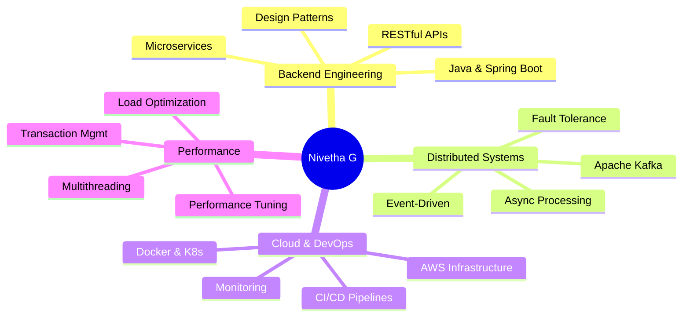

<div align="center">
  
  
  
</div>

<div align="center">
  
  
  
</div>

<p align="center">
  <a href="https://www.linkedin.com/in/nivetha-g-b287871b9/"></a>
  <a href="https://nivetha-g-dev-portfolio.vercel.app/"></a>
  <a href="https://www.instagram.com/nivetha_.g_/"></a>
  <a href="mailto:nivethag.dev@gmail.com"></a>
</p>


##  About Me

```typescript
const Nivetha = {
    title: "Backend Software Engineer",
    location: "Chennai, Tamil Nadu 📍",
    focus: ["Microservices", "Distributed Systems", "Cloud Architecture"],
    currentlyLearning: ["Advanced Kubernetes Patterns", "System Design at Scale"],
    experience: {
        microservices: "70+ in production",
        uptime: "99.9%",
        specialization: "Event-Driven Architecture"
    },
    askMeAbout: ["Java", "Spring Boot", "Kafka", "AWS", "Docker", "Kubernetes"],
    funFact: "I debug production issues faster than I solve coding puzzles! 🐛"
};
```


## 🎯 What I Do

<table>
<tr>
<td width="50%">

### 💡 **Backend Excellence**
- Design & implement scalable microservices
- Event-driven architecture with Kafka
- RESTful API development & optimization
- Database design & performance tuning

</td>
<td width="50%">

### ☁️ **Cloud & DevOps**
- AWS cloud infrastructure (EKS, EC2, RDS, S3)
- Container orchestration (Docker, Kubernetes)
- CI/CD pipelines & automation
- Production monitoring & debugging

</td>
</tr>
</table>


## 🛠️ Tech Arsenal

<details open>
<summary><b>🔥 Core Technologies</b></summary>
<br>


</details>

<details open>
<summary><b>💾 Databases</b></summary>
<br>


</details>

<details open>
<summary><b>☁️ Cloud & DevOps</b></summary>
<br>


</details>


## 💼 Professional Journey

<details open>
<summary><b>🏢 Amdocs India Private Ltd</b> • <i>Experienced Software Developer</i> • Aug 2023 – Sep 2025</summary>
<br>

| Achievement | Impact |
|-------------|--------|
| 🏗️ **Disaster Recovery Architecture** | Designed hybrid DR solution on AWS EKS for 70+ microservices with 99.9% uptime |
| ⚡ **Kafka DLQ Automation** | Achieved 100% message recovery, reduced manual intervention by 40% |
| 🔧 **SDK Compatibility** | Led initiative across 70+ services with zero production incidents |
| 📊 **Database Migrations** | Integrated Liquibase across 6+ environments, eliminated manual scripts |
| 🐛 **Quality Improvements** | Reduced production bugs by 20% through comprehensive testing |

</details>

<details>
<summary><b>🏢 OpalMinds IT Solution</b> • <i>Contract Software Engineer</i> • Nov 2025 – Dec 2025</summary>
<br>

- ☁️ Built cloud-native microservices for import/export permit automation
- 🔐 Implemented role-based access control with secure request tracking
- 🔄 Designed XML transformation layer for SDK integration
- 📈 Deployed AWS infrastructure with centralized monitoring

</details>


## 📊 GitHub Analytics

<p align="center">
  
  
</p>

<p align="center">
  
</p>


## 🏆 Achievements Unlocked

<p align="center">
  
</p>

<table align="center">
  <tr>
    <td align="center">
      
      <br><b>70+ Microservices</b>
      <br>in Production
    </td>
    <td align="center">
      
      <br><b>99.9% Uptime</b>
      <br>Achieved
    </td>
    <td align="center">
      
      <br><b>30% Efficiency</b>
      <br>Improvement
    </td>
    <td align="center">
      
      <br><b>20% Fewer Bugs</b>
      <br>in Production
    </td>
  </tr>
</table>


## 💡 Core Expertise




## 🤝 Let's Connect & Collaborate!

I'm passionate about building robust backend systems and always open to interesting conversations about:

<table align="center">
<tr>
<td align="center" width="25%">
  <br>
  <b>Open Source</b><br>
  Contributing to projects
</td>
<td align="center" width="25%">
  <br>
  <b>System Design</b><br>
  Architecture discussions
</td>
<td align="center" width="25%">
  <br>
  <b>Opportunities</b><br>
  Backend roles
</td>
<td align="center" width="25%">
  <br>
  <b>Tech Talks</b><br>
  Knowledge sharing
</td>
</tr>
</table>

<p align="center">
  📧 <b>Email:</b> nivethag.dev@gmail.com<br>
  🌐 <b>Portfolio:</b> <a href="https://nivetha-g-dev-portfolio.vercel.app/">nivetha-g-dev-portfolio.vercel.app</a><br>
  💼 <b>LinkedIn:</b> <a href="https://www.linkedin.com/in/nivetha-g-b287871b9/">Connect with me</a>
</p>


<div align="center">
  
  
  
  
  
  <b>⭐️ If you find my work interesting, feel free to star my repositories!</b>
  
</div>
